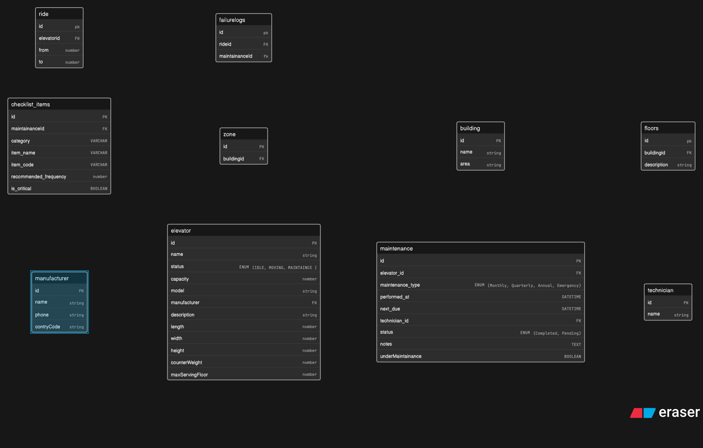
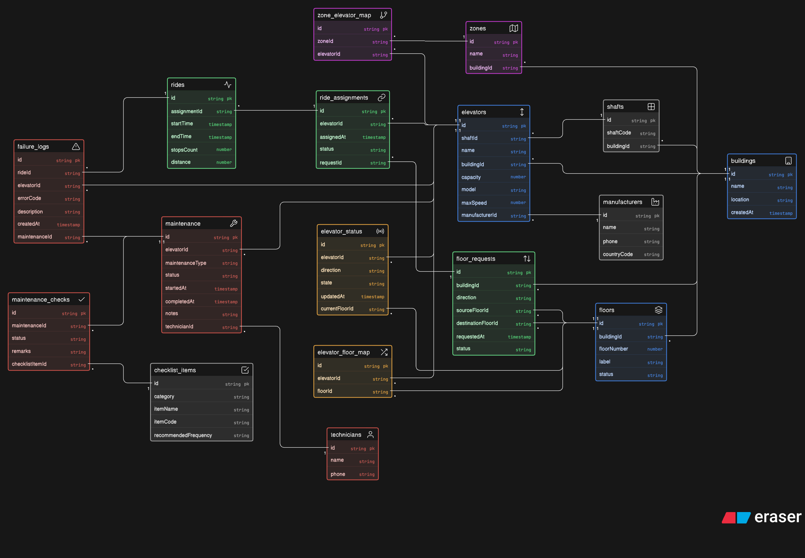

# 🚀 Elevator Control System — Design Journal

## ⏱️ Context

I had **1 hour** to design an elevator system. I started with a quick hand-drawn ERD (~20 mins), converted it into a basic schema, then used ChatGPT to identify gaps and refine the design into a more realistic system. This document captures that fast iteration from rough thinking → structured model → improved architecture.

---

## 🧠 Initial Thought Process (First 20 mins)

I started with a **rough mental model** instead of jumping straight into schema design.

I asked myself:

* What are the core entities?
* What flows exist in the system?
* What needs to be tracked over time?

Then I quickly sketched a **hand-drawn ERD**.

### 📸 Rough Planning

This helped me identify:

* Elevators as the central entity
* Movement (`from -> to`) as rides
* Maintenance as a critical lifecycle
* Buildings → Zones → Floors hierarchy

⚠️ At this stage, the model was **incomplete and messy** — but that’s expected. The goal here was speed, not perfection.

---

## 🏗️ First Structured Schema (My Draft)

After the sketch, I translated the idea into a structured schema.

### Key Entities I Identified

* `manufacturer`
* `elevator`
* `maintenance`
* `technician`
* `checklist_items`
* `building`, `zone`, `floors`
* `ride`
* `failurelogs`

### 📸 Initial ERD

### What I Got Right ✅

* Captured **core elevator metadata** (capacity, model, dimensions)
* Introduced **maintenance lifecycle**
* Included **failure logs** (important for debugging systems)
* Modeled **building hierarchy**

### What I Missed ❌

This is where things got interesting.

I missed several **system-level abstractions**:

* `elevator_shaft`
* `floor_request`
* `ride_assignment`
* `elevator_floor_service` (many-to-many)
* `elevator_status_log`

👉 These are not obvious unless you think in terms of **real-world system behavior**, not just data storage.

---

## 🤖 Iteration with ChatGPT

To fill the gaps, I used ChatGPT to challenge and extend my model.

It helped introduce:

* Request → Assignment → Ride flow
* Separation of **request vs execution**
* Status tracking over time
* Better normalization

This step wasn’t about copying — it was about **learning what I failed to consider**.

---

## 🧩 Final ERD

### 📸 Final Design

---

## 🔍 Summary of Improvements

The final iteration improved the model by introducing clearer separation of concerns and better alignment with real-world system behavior. The design evolved from a direct ride-based approach to a more structured flow (request → assignment → execution), added state tracking for elevators, and handled many-to-many relationships such as elevator-to-floor mapping. It also incorporated zoning for scalability, structured maintenance tracking, and better failure observability. Overall, the system moved from a basic data model to a more realistic and extensible architecture.

---

## ⚠️ Known Tradeoffs & Gaps

I knowingly left some parts under-defined:

* Maintenance details are **not exhaustive**
* No strict enum constraints everywhere
* No user/passenger entity
* No real-time queue optimization logic

👉 But given the **time constraint (1 hour)**, this level of depth is acceptable.

---

## 🧠 What I Learned

### 1. Start messy, then refine

Trying to be perfect from the start slows you down.

### 2. Think in flows, not tables

The biggest improvements came when I modeled:

* Request → Assignment → Execution

### 3. Real systems ≠ CRUD apps

You need:

* State tracking
* Time-based logs
* Event thinking

### 4. External feedback is powerful

Using ChatGPT exposed blind spots quickly.

---

## 🏁 Final Thoughts

This wasn’t about getting the “perfect ERD”.

It was about:

* Moving fast
* Identifying gaps
* Iterating intelligently

And honestly — that’s what system design is all about.

---
